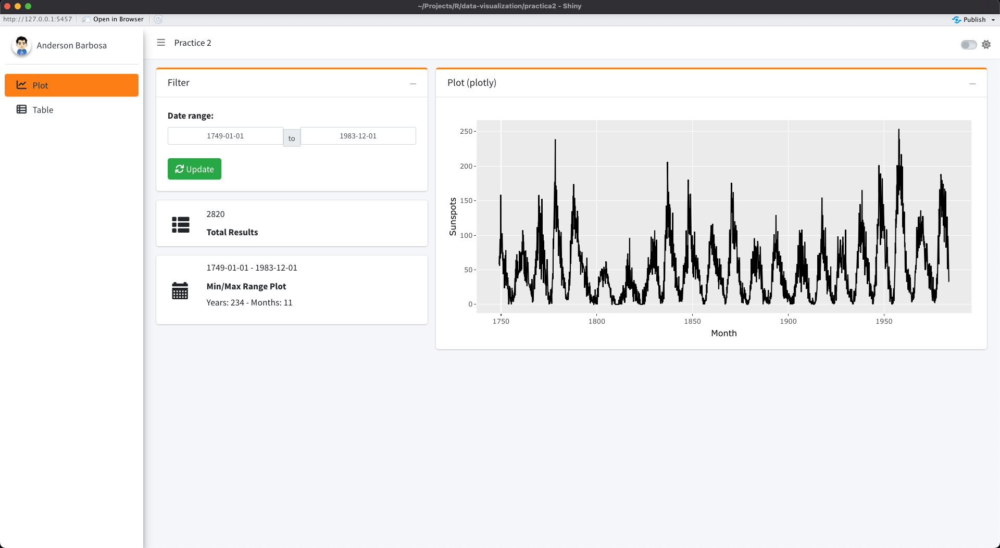
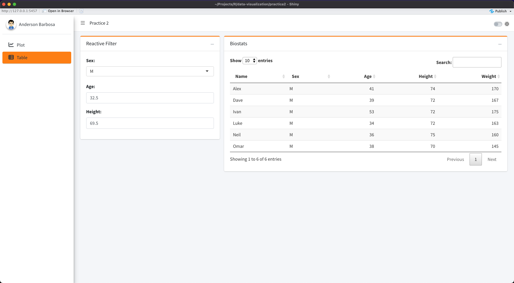

# Project Practice 2

Data Visualization Project with Shiny

## R packages
1. shiny
2. bs4Dash (shinydashboard)
3. dplyr
4. DT
5. ggplot2
6. plotly
7. lubridate

## Plot

## Table

## Helps

1. https://alvaroferro.shinyapps.io/practica2/
2. https://rinterface.github.io/bs4Dash/reference/index.html
3. https://rstudio.github.io/shinydashboard/structure.html